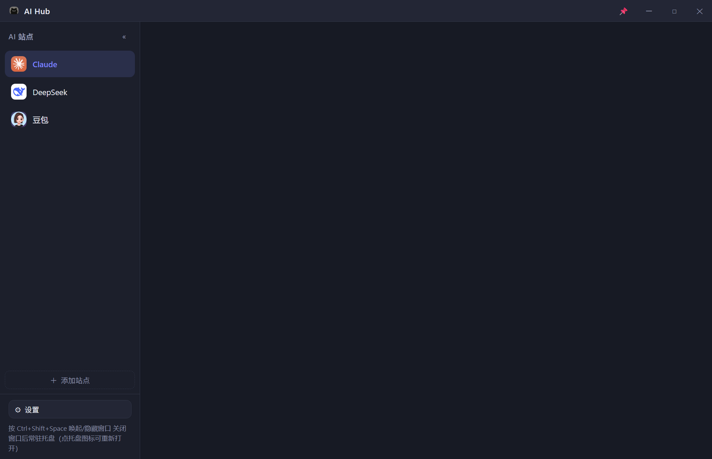

# AI Hub

> 把多个 AI 聊天网站装进一个可随时唤起的桌面面板 —— 全局快捷键呼出、免登录态管理、单窗口多站点。

AI Hub 是一个跨平台桌面客户端（**Windows 11 / macOS**），将 Claude、DeepSeek、豆包等 AI 聊天网站聚合到一个可随时呼出的窗口：

- ⚡ **全局快捷键唤起/隐藏**：默认 `Ctrl+Shift+Space`，任意应用内一键呼出，**唤起后自动聚焦当前站点的输入框，直接打字即可**
- 🔐 **登录态持久化**：每个站点独立 session 分区，登录一次永久记住，站点间互不干扰
- 🗂️ **单窗口多站点**：左侧边栏一键切换；支持**拖动排序**、右键编辑/删除、增删任意 AI 网址
- 🧠 **省内存**：切换站点自动销毁旧页面（登录态保留，重进自动恢复）；记住上次站点，启动直接打开
- 🌗 **亮/暗/跟随系统主题**：一键切换，同步进内置网页（支持深色的站点自动跟随）
- 📌 **系统托盘常驻**：关闭窗口 = 隐藏到托盘；托盘菜单可置顶/唤起/退出
- 🛡️ **受限环境自动降级**：GPU/沙箱异常时自动软件渲染重启（远程桌面/虚拟机友好）



## 快速开始

```bash
npm install        # 安装依赖
npm start          # 本地运行（生产模式）
npm run dev        # 开发模式（改 renderer/ 自动 reload，改 main.js 自动重启）
```

> 国内网络建议设置镜像：
> ```bash
> ELECTRON_MIRROR=https://npmmirror.com/mirrors/electron/ npm install
> ```

**开发热更新**：`npm run dev` 下，修改 `renderer/` 文件秒级自动刷新；修改 `preload.js` 自动 reload；修改 `main.js` 自动重启主进程（闪一下窗口）。

## 使用

| 操作 | 方式 |
|---|---|
| 唤起/隐藏窗口 | `Ctrl+Shift+Space`（可改，设置里录制） |
| 唤起即输入 | 窗口唤起后光标自动停在当前站点输入框，直接打字 |
| 切换站点 | 点左侧站点列表（自动关闭旧页面省内存） |
| 拖动排序 | 展开侧边栏后按住站点上下拖动 |
| 添加站点 | 侧边栏底部「＋ 添加站点」 |
| 编辑/删除站点 | **右键**站点 → 编辑弹窗（改名/改网址/删除） |
| 删除时清数据 | 删除确认弹窗勾选「同时删除本地数据和缓存」可彻底清除登录态 |
| 主题切换 | 设置 → 外观主题（亮色/暗色/跟随系统） |
| 收起侧边栏 | 侧边栏头部 `«` 收起为图标列，`»` 展开 |

> **注意**：切换站点会销毁旧页面，未发送的输入内容会被丢弃（省内存的设计取舍）。

## 打包发布

### 本地打包

```bash
npm run dist:win     # Windows：NSIS 安装包 → dist/AI-Hub-<版本>-x64.exe
npm run dist:mac     # macOS：dmg（需在 macOS 上执行）
npm run dist         # 当前平台打包
```

产物命名自动带版本号（`artifactName: AI-Hub-${version}-${arch}.${ext}`）。

### GitHub Actions 自动发布

仓库配置好 `.github/workflows/release.yml` 后，**打 tag 即自动编译双平台安装包并发布**：

```bash
git tag v0.1.0
git push origin v0.1.0
```

推送 `v*` 格式的 tag 后，CI 会自动：
1. `macos-latest` + `windows-latest` 并行构建
2. 版本号与 tag 同步（`v0.1.0` → `package.json` 的 `0.1.0`）
3. 生成 Windows NSIS 安装包 + macOS dmg/zip
4. 自动创建 GitHub Release 并上传安装包

> 默认不签名也能出包；需要正式代码签名时，在仓库 Secrets 配置 `CSC_LINK` + `CSC_KEY_PASSWORD` 并去掉 workflow 中的 `CSC_IDENTITY_AUTO_DISCOVERY` 即可。

## 配置

配置文件位于用户数据目录 `config.json`：

| 平台 | 路径 |
|---|---|
| Windows | `%APPDATA%\AI Hub\config.json` |
| macOS | `~/Library/Application Support/AI Hub/config.json` |

```json
{
  "shortcut": "Ctrl+Shift+Space",
  "alwaysOnTop": false,
  "sidebarCollapsed": false,
  "theme": "system",
  "sites": [
    { "id": "claude", "name": "Claude", "url": "https://claude.ai/chat/", "enabled": true }
  ]
}
```

- `shortcut`：Electron `accelerator` 语法（如 `Alt+Space`、`CommandOrControl+Shift+A`）
- `theme`：`light` / `dark` / `system`
- 站点登录数据存于 `Partitions/site-<id>` 子目录；删除站点默认**保留**登录数据（重新添加即恢复登录）
- 诊断日志：`userData/aihub.log`

## 技术架构

| 模块 | 说明 |
|---|---|
| `main.js` | 主进程：窗口管理、全局快捷键、托盘、`WebContentsView` 多标签、session partition 持久化、主题同步、唤起自动聚焦输入框 |
| `preload.js` | `contextBridge` 暴露安全 IPC 接口 |
| `renderer/` | 侧边栏站点列表（拖动排序/右键菜单）、自定义标题栏、添加/编辑/设置弹窗、亮暗主题 |
| `scripts/launch.js` | 启动脚本：清除危险环境变量（`ELECTRON_RUN_AS_NODE`/`NODE_OPTIONS`）+ dev 文件监听热更新 |
| `scripts/sync-version.js` | CI 用：发布时把 package.json 版本号与 git tag 同步 |
| `.github/workflows/release.yml` | 打 tag 自动构建双平台安装包并发布到 GitHub Release |
| `electron-builder` | Windows NSIS / macOS dmg 打包 |

关键设计：

- **登录态持久化**：每站点独立 `persist:site-<id>` partition，Cookie 落盘；OAuth 弹窗与主视图共享同 session（Google/GitHub 登录自动同步）
- **UA 伪装**：自动去掉 User-Agent 中的 `Electron` 标识，第三方站点识别为普通 Chrome
- **唤起即聚焦**：显示窗口时先把键盘焦点切到站点 webContents（`wc.focus()`），再 `el.focus()` 输入框——解决多 webContents 下按键被侧边栏截获的问题
- **主题进网页**：`nativeTheme.themeSource` 驱动 `prefers-color-scheme`，内置站点深色模式自动跟随
- **隐藏即驻留**：关闭拦截为隐藏，进程常驻托盘；单实例锁防重复启动
- **自动降级**：GPU/渲染进程异常时自动带 `--disable-gpu --no-sandbox` 重启一次
- **测试隔离**：DIAG 测试强制使用独立临时 userData（`--user-data-dir`），绝不触碰真实登录态

## 开发调试

环境变量：

| 变量 | 作用 |
|---|---|
| `AIHUB_SCREENSHOT=1` | 窗口显示 4 秒后自动截图到 `userData/ui.png` |
| `AIHUB_DIAG=1` | 运行完整功能测试（强制隔离 userData，**不可在真实数据上跑**） |
| `AIHUB_TEST_DATA=1` | 强制使用独立临时 userData 目录（测试隔离） |

## 已知限制

- 第三方站点由系统 WebView 渲染，无法像 Chrome 扩展那样控制；个别站点对非标准浏览器设限时可能提示升级浏览器（可改 `cleanUA` 保留 Electron 标识）
- macOS 打包需在 macOS 环境执行
- 切换站点会销毁旧页面（省内存），未发送内容会丢失
- 运行中删除站点分区目录可能被系统句柄锁（EPERM），数据已清空但目录残留会在下次启动自动清理

## 项目结构

```
ai-chat-hub/
├── main.js                # 主进程（含调试钩子 runDebugHooks）
├── preload.js             # 预加载脚本
├── renderer/              # 渲染层 UI
│   ├── index.html
│   ├── style.css
│   └── app.js
├── scripts/
│   ├── launch.js          # 启动 + dev 热更新 + 测试隔离
│   └── sync-version.js    # CI 发布：tag 版本号同步
├── .github/workflows/     # GitHub Actions 自动发布
├── build/                 # 应用图标
├── docs/demo/             # 预览截图
└── package.json           # 依赖与打包配置
```

## License

MIT
